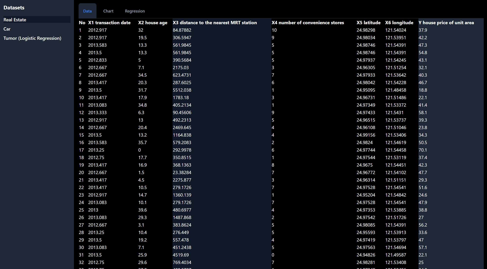

# Data Demo

Simple demo demonstrating regression with Typescript / Javascript:
- Linear regression
- Logistic Regression

Logistic regression uses gradient descent with loss function. Currently only tested with one dimension, but code is written with matrices so should be simple to extend to multiple dimensions.

Datasets can be toggled via the left sidebar, while data, chart, and regression info for a given dataset can be viewed with the tabs.

Chart currently only plots a single independent variable dimension.





## Getting Started

First, run the development server:

```bash
npm run dev
# or
yarn dev
# or
pnpm dev
```

Open [http://localhost:3000](http://localhost:3000) with your browser to see the result.

You can start editing the page by modifying `pages/index.tsx`. The page auto-updates as you edit the file.

[API routes](https://nextjs.org/docs/api-routes/introduction) can be accessed on [http://localhost:3000/api/hello](http://localhost:3000/api/hello). This endpoint can be edited in `pages/api/hello.ts`.

The `pages/api` directory is mapped to `/api/*`. Files in this directory are treated as [API routes](https://nextjs.org/docs/api-routes/introduction) instead of React pages.

This project uses [`next/font`](https://nextjs.org/docs/basic-features/font-optimization) to automatically optimize and load Inter, a custom Google Font.

## Tests

```
npm test
```

## Hire Me

https://www.jbernier.com/

https://www.linkedin.com/in/jeremysbernier/